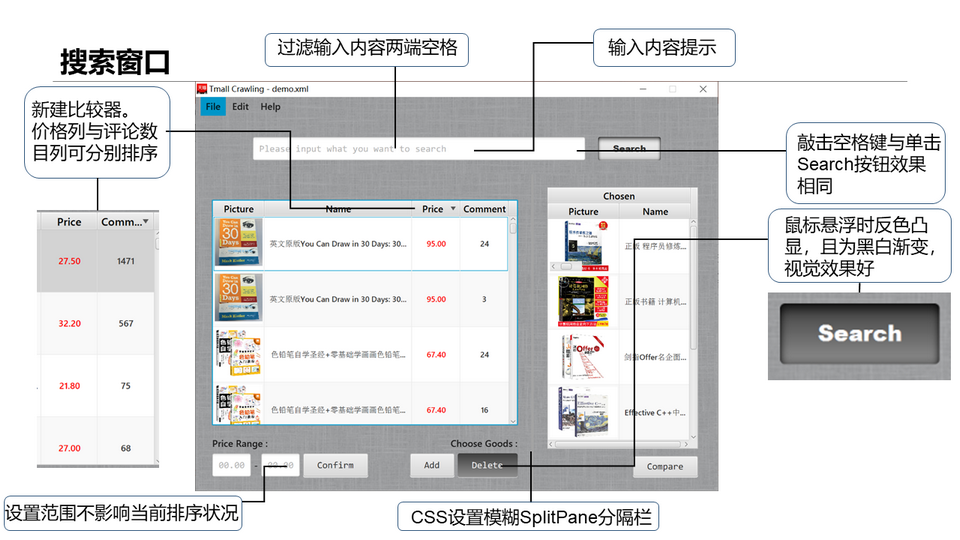
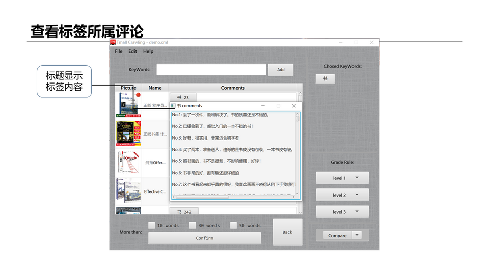

# SUSTech-CS209A-Project Comments-Crawling  
SUSTech CS209A, final term project  
## 南科大课程 CS209A 计算机系统设计及应用A 期末Project作业
该项目为小组作业，与同学共同完成。  
本人主要负责搜索界面，项目美工与代码整合。

### Project 要求
Project 要求参考：<https://github.com/CatFood-is-CatFood/Comments-Crawling/blob/master/CS209A-Spring2019-Project.pdf>

1、从在线购物平台下载评论并定时更新。  
2、分析评论语句，提取标签。  
3、数据可视化，绘制图表或动画。  
4、保存数据。打开软件时默认载入上次已保存数据。

### 程序说明
本程序在线购物平台选择天猫，获取选定商品的评论并分析，默认每5分钟更新一次评论数据。请勿用于违法违规行为。

天猫访问搜索结果第2页及以后需要登录信息，暂无解决方案，只获取了搜索结果第一页内容。

运行时 Login 窗口要求输入 cookie，请在浏览器中查找名为 "x5sec" 的 cookie，将其内容输入。  
天猫获取评论需要登陆，不携带 cookie 访问评论页面，会定向到登陆页面，携带该 cookie 可则不会。"x5sec" 有时查找不到，暂不知道解决办法，只能看运气。  
cookie 暂未设置校验程序，若输入错误，则爬到的评论文件均为空。

["data/Comments"](https://github.com/CatFood-is-CatFood/Comments-Crawling/tree/master/data/Comments) 目录存放下载的评论。  
存放时已删除与已下载内容重复的评论。由于是并行流下载，故各评论页面下载不知先后。  
天猫最多访问99页评论，若评论不足99页，则访问页面页码高于评论拥有实际最大页码时，访问结果均为最大页码页面。  

### 运行截图  
#### 搜索窗口：  
  
  
#### 登录窗口：  
  
  
#### 比较面板：  
  
#### 查看评论：  
  
#### 得分统计：  
  
#### 好评率统计：  
  
#### 关键词匹配情况：  

---
### 2019.5.27 更新
#### 更新内容
1. 增添了鼠标悬浮在任一表格商品名称上时，显示过长商品名全称的提示
2. 搜索界面下，将Add按钮调整到右边
3. 搜索界面下，对Chosen表单实现撤销与重复功能
4. 比较界面下，勾选较大评论长度选项现在会连同勾选较小选项，且较大选项选中时，较小选项不得取消。更符合时长选项间的包含关系
5. 比较面板下，增添了Compare按钮自身响应，直接显示三类表格
6. 修复了绘制图表时，商品名前几个字相同时图表绘制重叠的BUG

#### 待改进
1. 增加验证cookies是否正确的功能
2. 增加登陆天猫获取cookies的功能
3. 增加鼠标悬浮图片上时放大图片的功能